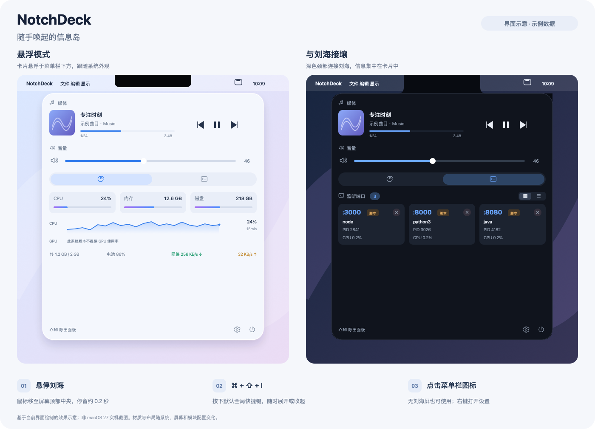

# NotchDeck

把 MacBook Pro 的刘海变成一个随手可用的信息控制台。

鼠标悬停刘海即展开**悬浮岛屿面板**，内容模块化组织：顶部**常驻区** + 底部**标签页区**，支持媒体控制、系统监控、Node 进程管理、音量控制与用户自定义命令小部件。悬停检测仅读取鼠标坐标，**不需要辅助功能或输入监控权限**。

## 效果预览



左侧展示**悬浮模式**，右侧展示**与刘海接壤模式**。效果图根据当前界面绘制，曲目、端口和监控数值均为示例，**不是 macOS 27 实机截图**；实际玻璃材质与内容随系统外观、屏幕和模块配置变化。[查看 SVG 源图](docs/images/notchdeck-preview.svg)。

## 如何唤起信息岛

先启动 `NotchDeck.app`。应用在菜单栏运行，信息岛默认收起，不会弹出常驻主窗口。

| 唤起方式 | 操作 |
| --- | --- |
| **悬停刘海** | 将鼠标移到带刘海屏幕的**最上边缘中央**，停留约 **0.2 秒**，信息岛自动展开。默认开启，无需辅助功能或输入监控权限。 |
| **全局快捷键** | 按 **`⌘ + ⇧ + I`**（Command + Shift + I）展开；再次按下可收起。 |
| **菜单栏图标** | 单击菜单栏中的 **NotchDeck 小矩形图标**，即可展开或收起；右键单击（或按住 Control 单击）可打开“设置…”和“退出 NotchDeck”菜单。 |

**没有刘海的 Mac 或外接显示器**，使用快捷键或菜单栏图标即可。连接多个显示器时，面板优先显示在带刘海的内置屏；没有刘海屏时使用当前主屏。

默认开启“鼠标离开自动收起”，离开面板和刘海热区约 **0.5 秒**后收起。通过快捷键唤起且鼠标尚未进入面板时，面板会保持展开；也可再次按快捷键或单击菜单栏图标主动收起。

### 调整唤起方式和面板样式

点击信息岛右下角的**齿轮按钮**，或右键单击菜单栏图标选择**设置…**，进入**通用**页：

- **触发**：开关“悬停刘海自动展开”和“鼠标离开自动收起”；悬停延迟可调 **0.1～0.5 秒**，离开延迟可调 **0.3～2 秒**。
- **快捷键**：录制新的全局快捷键。如果默认组合键被其他应用占用，可通过菜单栏打开设置后更换。
- **面板**：开启“与刘海接壤（视觉一体）”切换为接壤样式；关闭则使用悬浮样式。无刘海屏自动使用悬浮样式。

如果悬停没有反应，先确认应用正在运行、“悬停刘海自动展开”已开启，并把鼠标移到**刘海屏最上边缘**；也可以先用快捷键或菜单栏图标呼出面板。

## 功能

### 面板与交互
- 悬停刘海自动展开（默认 0.2s 延迟，可调 0.1~0.5s）；鼠标离开自动收起（默认 0.5s 延迟，可调 0.3~2s）
- 全局快捷键 `⌘⇧I`（可自定义录制）、菜单栏图标兜底（右键菜单含设置/退出）
- 悬浮岛屿样式：四角大圆角卡片悬浮于菜单栏下方，**不覆盖、不加宽刘海**；窗口最大 520 × 580pt，内容统一滚动，底栏保持可见
- 上下两层布局：常驻区（空则不占位）+ 标签页区（多模块图标切换）
- macOS 26+ 悬浮面板使用系统 Liquid Glass（需 Xcode 26+ 构建），旧系统保留毛玻璃；跟随浅色/深色、减少透明度、增强对比度与减弱动态效果设置
- 接壤模式按屏幕安全区与刘海对齐；换屏、切换空间或唤醒后同步刷新窗口与轮廓，无刘海屏自动使用悬浮卡片

### 模块（可在设置中开启/关闭、配置常驻或切换）
| 模块 | 说明 |
|---|---|
| 媒体 | 封面/标题/进度/播放控制。媒体源由用户在设置中添加（Music / Spotify），**添加哪个才请求哪个的授权**，未安装的源不会出现在列表中 |
| 应用 | 用户从**已安装应用选择器**中挑选常用 App 添加到面板：一键启动/退出、运行状态，白名单应用带"已适配"标记（当前适配 Music、Spotify）。零权限（NSWorkspace 实现） |
| 音量 | 系统音量滑杆 + 静音切换，无需权限 |
| 系统监控 | CPU、内存、磁盘卡片 + **CPU 近 15 分钟热力图** + **交换内存（swap）** + **电池**（电量/充电状态/容量/健康度/循环次数）+ 网络速率，每秒刷新；各区块显示可在设置 → 监控 中开关。GPU 与风扇因当前 macOS 移除用户态统计接口（IOReport 框架已删、SMC 协议已变，均经探针实证）暂不可用，面板自动隐藏；实现零第三方依赖 |
| 进程监控 | **零配置**列出当前用户所有监听 TCP 端口的进程（系统守护进程除外）：App 名/脚本名智能展示、PID/CPU/内存、一键 SIGTERM、退出自动移除 |
| 自定义 | 用户添加 shell 命令小部件（如 `ipconfig getifaddr en0`），面板展开时自动执行并展示输出 |

### 已适配白名单
`Core/ModuleFramework.swift` 中的 `AdaptedApps.whitelist` 记录已深度适配的 App（bundleID → 能力说明）。用户在选择器或设置中看到这些应用时，会显示"已适配"徽章，表示 NotchDeck 为其提供超出启动/退出的集成能力（如媒体播放控制）。扩展适配只需在白名单加一行并实现对应集成逻辑。

### 权限模型（默认最小权限）
- 全新安装启动：**不发起任何 AppleScript、不申请任何权限**，面板完整可用（监控/Node/音量/应用/自定义/交互）
- 媒体模块默认显示"未添加媒体源"引导；用户在设置中开启某个源后，**该 App 运行后首次读取才触发自动化授权弹窗**，由 macOS 管理授权，拒绝也只影响该源
- 应用快捷控制走 `NSWorkspace` / `NSRunningApplication`，启动/退出用户自己的应用**无需任何权限**
- 悬停检测仅读取鼠标坐标（`NSEvent.mouseLocation`），无需辅助功能/输入监控权限

## 模块框架

面板是一个模块化框架（`Core/ModuleFramework.swift`）：

```swift
protocol NotchModule: ObservableObject {
    var id: String { get }          // 持久化配置 key
    var title: String { get }       // 名称
    var systemImage: String { get } // SF Symbol 图标
    var isAvailable: Bool { get }   // 不可用时不出现在面板与设置
    func start()                   // 启用时开始采集/订阅
    func stop()                    // 关闭时停止采集并取消任务
    associatedtype Content: View
    func content() -> Content       // 面板内容
}
```

实现协议并 `registry.register(module)` 即可获得：设置中的开关与位置配置（常驻/切换）、布局与动画、滚动容器和生命周期管理。内置六个模块全部走这套协议；"自定义子项"模块是用户扩展的第一入口，后续可基于此加载更丰富的外部插件。

## 环境要求

- macOS 13 Ventura 及以上
- 带刘海的 MacBook Pro（无刘海的显示器上可通过快捷键 / 菜单栏图标呼出）
- Xcode 15+ 与 [xcodegen](https://github.com/yonaskolb/XcodeGen)

### macOS 27 展示适配

展示层使用公开 API 按系统能力适配，保留 macOS 13 的最低运行版本。窗口、颈部轮廓和悬停热区统一使用目标屏幕的几何数据，兼容菜单栏高度变化、侧边 Dock、缩放与多屏坐标；接壤模式显式处理 HostingView 安全区，避免刘海 inset 被重复计算。悬浮模式在 macOS 26 及后续版本使用系统玻璃效果，接壤模式保持深色以融入硬件刘海。

当前验证环境为 macOS 26.6.2（25G83）、Xcode 26.6 / macOS 26.5 SDK。**macOS 27 尚未实机验证**，不能据此宣称已全面兼容；升级后需复核浅色/深色、两种面板样式、全屏空间、外接屏切换及辅助功能外观。实验性系统正在播放仍按独立的媒体兼容状态显示，不将展示适配视为私有媒体接口已验证。

本次 Debug / Release 构建及 31 项回归测试通过（其中 10 项为屏幕布局测试）。应用启动与内容导出通过；`cacheDisplay` 不能可靠还原系统玻璃材质，且屏幕截图权限未开启，完整玻璃效果及辅助功能外观仍需人工复核。

## 构建与运行

```bash
brew install xcodegen        # 首次
xcodegen generate            # 由 project.yml 生成 NotchDeck.xcodeproj
open NotchDeck.xcodeproj     # Xcode 中 ⌘R 运行
```

或纯命令行构建：

```bash
xcodegen generate
xcodebuild -project NotchDeck.xcodeproj -scheme NotchDeck -configuration Debug build
```

> `.xcodeproj` 由 `project.yml` 生成，已加入 .gitignore，修改工程配置请编辑 `project.yml`。

## 工程结构

```
NotchDeck/
├── project.yml                    # xcodegen 工程定义
├── App/
│   ├── NotchDeckApp.swift         # 入口（SwiftUI App + AppDelegate 适配器）
│   └── AppDelegate.swift          # 初始化窗口、菜单栏、快捷键、设置窗口
├── Core/
│   ├── ModuleFramework.swift      # NotchModule 协议 + 注册表（面板框架核心）
│   ├── AppModel.swift             # 单例聚合根：状态 + 模块 + 布局计算
│   ├── NotchWindowController.swift# 悬浮岛屿 NSPanel：状态机 + 屏幕定位
│   ├── MouseTracker.swift         # 鼠标轮询（0.1s）悬停/离开检测
│   ├── HotKeyManager.swift        # Carbon 全局快捷键
│   ├── SettingsStore.swift        # UserDefaults 封装（含模块配置）
│   └── Shell.swift                # 外部命令执行（带超时）
├── Modules/
│   ├── Media/                     # 媒体：源注册表 + JXA / AppleScript（按需授权）
│   ├── Apps/                      # 应用快捷控制 + 已安装应用扫描
│   ├── Volume/                    # 音量：CoreAudio 默认输出设备
│   ├── System/                    # 系统监控：Mach 统计 / sysctl 64 位网络计数
│   ├── Node/                      # Node 进程：lsof / ps / kill(SIGTERM)
│   └── Custom/                    # 自定义命令小部件
├── UI/                            # SwiftUI 视图（面板 / 标签栏 / 各模块 / 设置）
└── Resources/Assets.xcassets
```

## 设计要点

- **最小权限**：默认安装零权限申请；媒体源按需添加、按需授权
- **多显示器**：优先使用带刘海的内置屏；无刘海时使用当前主屏。热区与面板保持在同一屏幕，窗口不超过可见区域
- **不碰刘海**：面板悬浮于菜单栏下方（留 6pt 间距），完全不覆盖刘海/菜单栏
- **动画**：展开/收起弹性过渡（缩放+位移动画）、标签页滑动切换、按钮按压缩放反馈；窗口窗口最大 520 × 580pt，内容统一滚动，底栏保持可见，时长与曲线协调避免"皮筋感"
- **媒体兼容策略**：MediaRemote 私有框架在 macOS 15.4+ 对第三方静默不应答且符号 ABI 已变化（ForOrigin 变体，错误调用会段错误），故不接入；媒体源在 `MediaModule.knownSources` 注册，通过有超时的 osascript 子进程读取；扩展新 App 时需适配其脚本字典、时间单位和封面格式
- **性能**：鼠标轮询 0.1s / 次，系统监控 1s / 次，Node 扫描 2s / 次（后台队列），采集在后台串行队列执行，关闭模块会停止轮询并取消任务
- **安全**：不收集任何数据，所有监控仅本地处理

## 回归验证

```bash
xcodegen generate
xcodebuild -project NotchDeck.xcodeproj -scheme NotchDeck \
  -destination 'platform=macOS' CODE_SIGNING_ALLOWED=NO test
```

`NotchDeckTests` 是无宿主逻辑测试，不启动 NotchDeck 主程序；设置写入临时 UserDefaults suite，媒体脚本使用模拟应用，不请求播放器授权。覆盖命令硬超时/取消/输出上限、模块生命周期、快捷键持久化、媒体元数据、系统采样与当前用户 TCP 监听扫描，以及刘海/无刘海、菜单栏自动隐藏、侧边 Dock、窄屏、负坐标多屏和悬停热区边界等布局场景。

自定义命令每条最多执行 6 秒，超时或取消时结束本次命令的进程组；标准输出和错误输出各保留最多 256 KiB，并区分成功无输出、非零退出码与超时。模块关闭后不再执行命令，变更配置会取消旧任务并丢弃过期结果。
